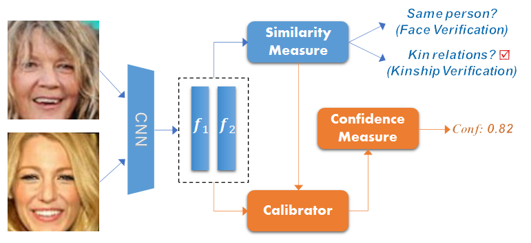
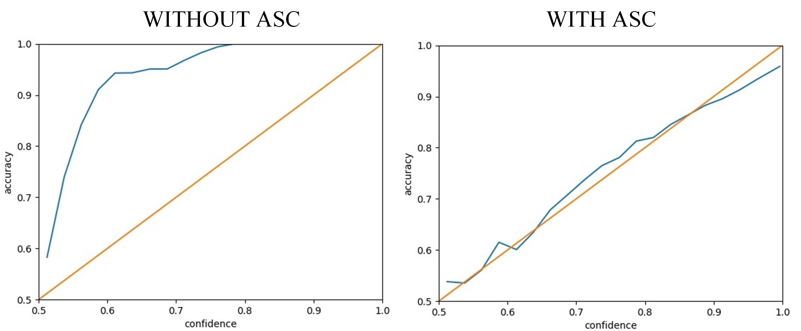

Offical implementation of ["Confidence-Calibrated Face and Kinship Verification"](https://arxiv.org/abs/2210.13905)  
  
  
We first introduce a simple yet effective confidence measure for face and kinship verification, which allows the   
verification models to transform the similarity score into a confidence score for a given face pair. We further  
propose a confidence-calibrated approach called angular scaling calibration (ASC). ASC is easy to implement and  
can be directly applied to existing face and kinship verification models without model modifications, yielding   
accuracy-preserving and confidence-calibrated probabilistic verification models.  
  

  

The pipeline of our method.  
  
### Installation

To run experiments, first clone the repository and install `requirements.txt`.
  

```
$ git clone https://github.com/cnulab/ASC.git
$ cd ASC
$ pip install -r requirements.txt
```
  
You can download the FIW dataset and models via ["Baidu Cloud"](https://pan.baidu.com/s/10JhgwV5qa8dJoPo1GeJmMw?pwd=6789) (pwd 6789) or ["Google Drive"](https://drive.google.com/drive/folders/19c49HVjRuvReX6ZA8_7_dslm2KB0LKDj?usp=share_link).  
Copy the model files to the `pretrain_models` and the FIW dataset to the `data`.
Unzip the FIW.zip, you can get the following directory structure. 
```
    |--data                         
        |--FIW           
            |--pairs
            |--Test
            |--Train
            |--Validation           
    |--pretrain_models
        |--resnet50.npy
        |--resnet101.npy
        |--torch_resnet50.py
        |--torch_resnet101.py
```

### Train  
You can train a ResNet101 network using InfoNCE loss.
```
$ python main.py --loss infonce --backbone resnet101 --optimizer sgd  --batch_size 25 --tau 0.08
```
The model will be saved in the `infonce_resnet101`. More commands (other losses and models) in `run.sh`.  
  
  
### Calibration
To evaluate and calibrate models.  
```
$ python calibration.py --model_path ./infonce_resnet101/infonce_resnet101_best_model.pkl --backbone resnet101 
```
Use the `--model_path` to set the path of you model. The calibration results will be saved in the `calibration` folder.  
  

