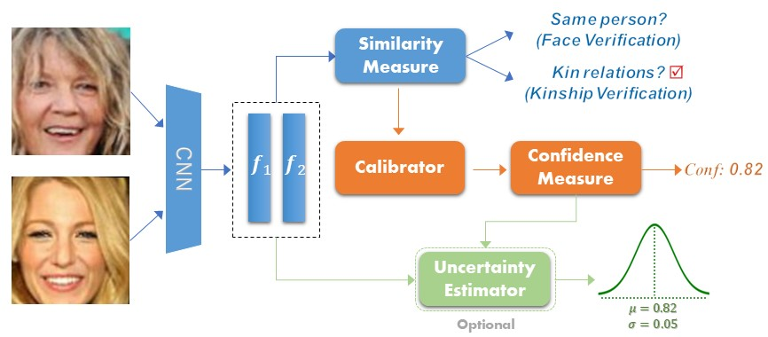
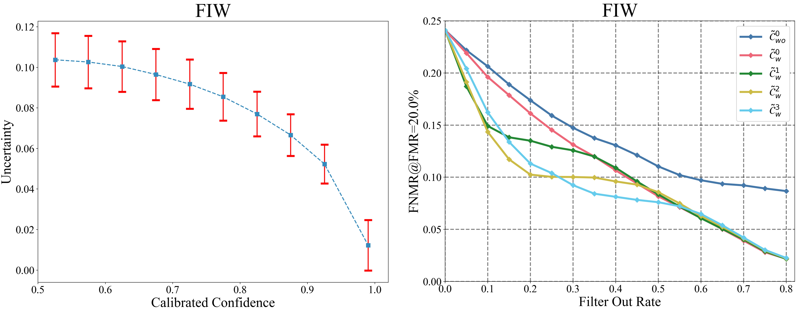

# Confidence-Calibrated Face and Kinship Verification

**💡 This is the official implementation of the paper ["Confidence-Calibrated Face and Kinship Verification"](https://ieeexplore.ieee.org/document/10262094) [[arxiv]](https://arxiv.org/abs/2210.13905)** 

**This work has been accepted by IEEE Transactions on Information Forensics and Security (TIFS).**   

We introduce a simple yet effective confidence measure for face and kinship verification, which allows the verification models to transform the similarity score into a confidence score for a given face pair. We propose a confidence-calibrated approach called Angular Scaling Calibration (ASC). ASC is easy to implement and can be directly applied to existing face and kinship verification models without model modifications, yielding accuracy-preserving and confidence-calibrated probabilistic verification models. In addition, we model the uncertainty of calibrated confidence to enhance the robustness of the verification models to noisy data. 

<div align=center></div>

## 📋 This Repository Can Do

1. **Confidence Measure ✔️**
2. **Confidence Calibration ✔️** 
3. **Uncertainty Estimation ✔️**

## 🔧 Installation

To run experiments, first clone the repository and install `requirements.txt`.
  

```
$ git clone https://github.com/cnulab/ASC.git
$ cd ASC
$ pip install -r requirements.txt
```

You can download the FIW dataset and pre-trained models via ["Baidu Cloud"](https://pan.baidu.com/s/1zloaFjpjRe_IoFL5rAixOg?pwd=6789) (pwd 6789) or ["Google Drive"](https://drive.google.com/drive/folders/19c49HVjRuvReX6ZA8_7_dslm2KB0LKDj?usp=share_link).  
Copy the model files to the `models` and the FIW dataset to the `data`.  
You can get the following directory structure. 
```
    |--data                         
        |--FIW           
            |--pairs
            |--Test
            |--Train
            |--Validation           
    |--models
        |--resnet50.pth
        |--resnet101.pth
```

## 🚀 Finetune 
You can finetune a pre-trained ResNet101 network using ArcFace loss:
```
$ python train_backbone.py --loss arcface --backbone resnet101  --optimizer adam  --batch_size 32  --s 10.0 --m 0.4 --image_size 112
```
The checkpoint will be saved in the `arcface_resnet101`. More commands (other losses and models) in [run.sh](run.sh).  
 

## 🔑 Calibration
Calibration using ASC: 
```
$ python calibration.py  --backbone resnet101  --model_root arcface_resnet101 --image_size 112
```
Use the `--model_root` to set the path of your checkpoint.

<div align=center></div>

## 🌐 Uncertainty Estimation
Learn an uncertainty prediction head using the following command:
```
$ python train_uncertainty.py  --backbone resnet101  --model_root arcface_resnet101 --image_size 112
```
The checkpoints will be saved in the `arcface_resnet101/heads`. Then use the following command for uncertainty estimation:
```
$ python eval_uncertainty.py  --backbone resnet101  --model_root arcface_resnet101 --image_size 112 --head_checkpoint_path 'heads/epoch_60_head.pkl'
```
<div align=center></div>

## 🔗 Citation
If this work is helpful to you, please cite it as:
```
@ARTICLE{xu2023confidence,
  author={Xu, Min and Zhang, Ximiao and Zhou, Xiuzhuang},
  journal={IEEE Transactions on Information Forensics and Security}, 
  title={Confidence-Calibrated Face and Kinship Verification}, 
  year={2023},
  doi={10.1109/TIFS.2023.3318957}
}
```
